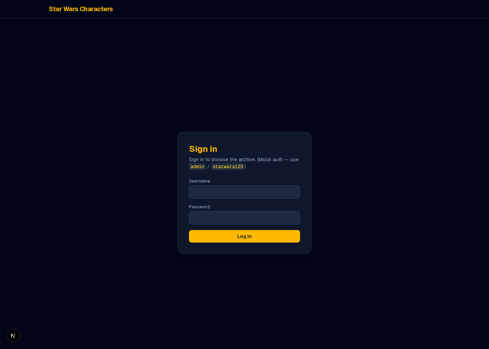
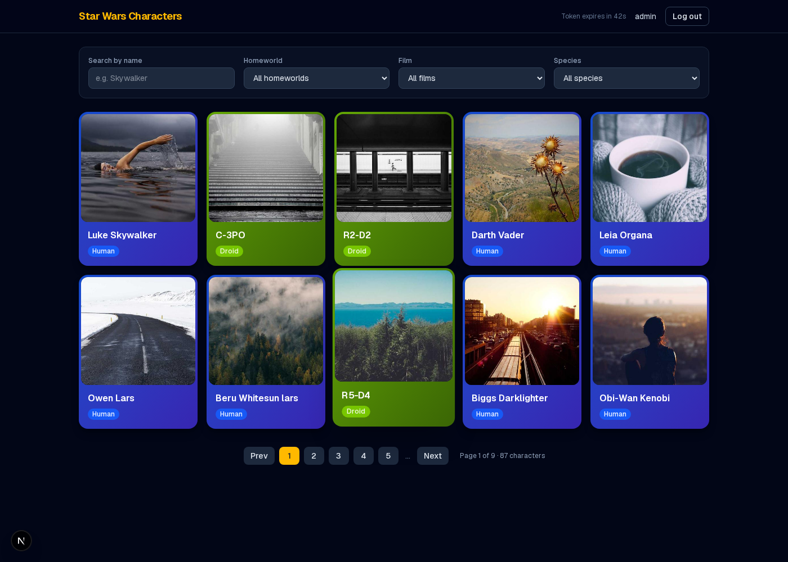
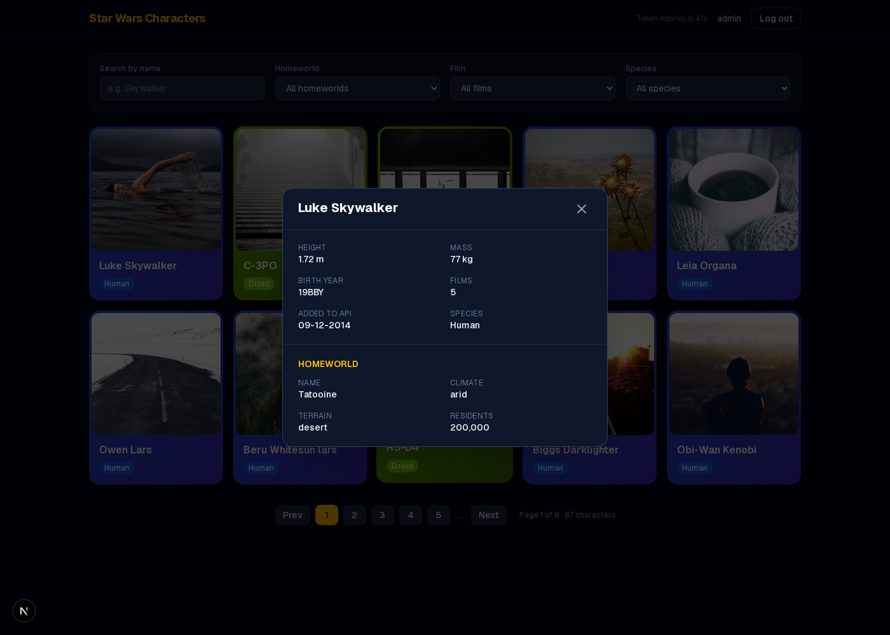
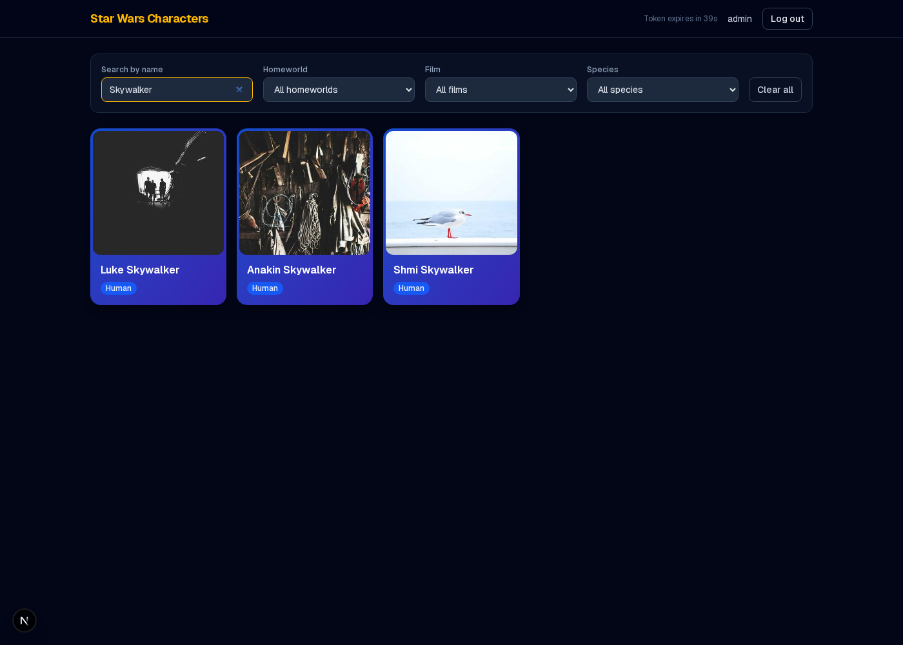

# Star Wars Characters

A React/Next.js + TypeScript app that browses Star Wars characters from the
[SWAPI](https://swapi.py4e.com) REST API, built as a MERN/TSX developer
assignment.

## Features

**Core**

- Character list from the `/people` endpoint with real API pagination
- Loading state while fetching/refetching, and an error state with retry if
  the API is unreachable
- One card per character: name + a random [Picsum](https://picsum.photos)
  portrait, colored by species, with a hover lift/scale animation
- Clicking a card opens a modal with: name, height (m), mass (kg), date
  added to the API (`dd-MM-yyyy`), number of films, birth year, and the
  character's homeworld (name, terrain, climate, residents)

**Brownie points**

- **Search & filter** — search by name (partial match) and filter by
  homeworld, film, or species, combinable with each other and with search
- **Mock JWT auth** — login/logout UI backed by a client-side mock JWT
  (access + refresh tokens), with silent refresh before the access token
  expires (see [How the mock auth works](#how-the-mock-auth-works))

## Screenshots

| Login | Character grid |
| --- | --- |
|  |  |

| Character modal | Search & filters |
| --- | --- |
|  |  |

## Tech stack

- **Next.js 16** (App Router) + **React 19** + **TypeScript**
- **Tailwind CSS 4** for styling
- **TanStack Query** for data fetching, caching, and loading/error state
- **Bun** as the package manager/runner (any Node package manager works too)

## Getting started

```bash
bun install
bun run dev
```

Open [http://localhost:3000](http://localhost:3000). You'll be redirected to
`/login` — sign in with:

```
Username: admin
Password: starwars123
```

Other scripts:

```bash
bun run build  # production build
bun run start  # run the production build
bun run lint   # ESLint
```

By default the app talks to `https://swapi.py4e.com/api` (a maintained
mirror of the original SWAPI, which has been unreliable). To point at a
different SWAPI-compatible host, set `NEXT_PUBLIC_SWAPI_BASE_URL` in a
`.env.local` file.

## How the mock auth works

The SWAPI itself doesn't require authentication, so the JWT flow here is a
self-contained client-side mock — there's no backend to call:

- Logging in checks the username/password against a hardcoded pair
  (`src/lib/auth/credentials.ts`) and mints a mock access token (45s TTL)
  and refresh token (30min TTL). Both are base64url-encoded
  `header.payload.signature`-shaped strings (`src/lib/auth/token.ts`) — not
  cryptographically signed, since there's no server-side secret to sign
  against.
- Tokens are persisted in `localStorage` so a refresh keeps you signed in.
- A timer scheduled a few seconds before the access token's expiry mints a
  new one automatically (silent refresh) as long as the refresh token is
  still valid; the navbar shows a live "token expires in Ns" countdown and
  a brief "session refreshed silently" toast when it happens.
- Logging out (or an expired refresh token) clears everything and sends you
  back to `/login`.

The short 45s access-token TTL is intentional, so the silent refresh is easy
to see/demo without a long wait — see `ACCESS_TOKEN_TTL_SECONDS` in
`src/lib/auth/token.ts` if you want to change it.

## How search/filter + pagination work together

The SWAPI paginates `/people` (10 per page) and supports `?search=` for
name matching, but has no way to filter by homeworld/film/species
server-side. So:

- With **no category filter** active, the app pages through the API
  directly (`/people/?page=N[&search=...]`) — this is the "real" API
  pagination.
- As soon as a **homeworld/film/species filter** is applied, the app fetches
  every page matching the current search term once, filters the results
  client-side against the selected homeworld/film/species, and paginates
  the filtered set locally (10 per page). This is what lets search and
  filters combine correctly.

Planets, films, and species are each fetched once (they're small,
non-paginated concerns) and cached — they populate the filter dropdowns,
resolve a card's species color, and supply the modal's homeworld details,
all without extra round trips.

## Project structure

```
src/
  app/                # routes: / (protected grid), /login
  components/         # CharacterCard, CharacterGrid, CharacterModal, ...
  hooks/               # useCharacterList, useReferenceData, useDebouncedValue
  lib/
    swapi.ts            # SWAPI client
    format.ts           # height/mass/date formatting
    species-color.ts     # species -> card theme, random portrait URL
    auth/                 # mock JWT + AuthContext
  types/swapi.ts         # Person/Planet/Film/Species types
```

## Deploying

This is a standard Next.js app, deployable to Vercel or Netlify.

**Vercel**

```bash
npm i -g vercel
vercel
```

Or connect the GitHub repo at [vercel.com/new](https://vercel.com/new) —
no environment variables are required unless you want to override the
SWAPI base URL.

**Netlify**

Connect the repo at [app.netlify.com](https://app.netlify.com) and use the
`@netlify/plugin-nextjs` build plugin (Netlify auto-detects Next.js and
installs it). Build command: `next build`.
